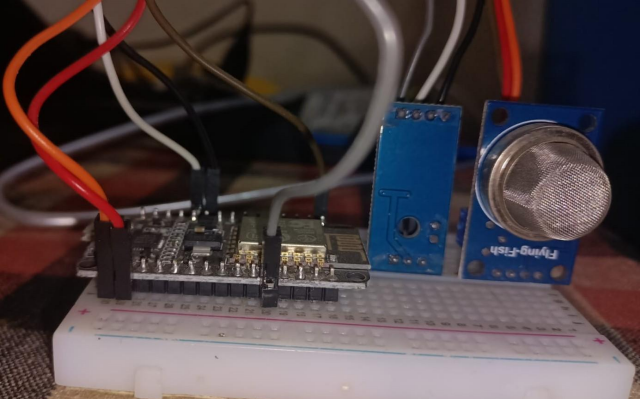

# Smart Mining Helmet 

## Directory Structure

```
.
├── cloud
│   ├── cloud.cpp
│   └── run.sh
├── display.cpp
├── display.sh
├── edge
│   └── edge.ino
├── filter.py
├── fog.conf
├── fogBack.cpp
├── helmet
│   ├── helmet2.py
│   ├── helmet3.py
│   └── helmet4.py
├── hstatus.dat
├── include
│   ├── Connection.h
│   ├── Screen.h
│   └── sensor.h
├── kill.sh
├── runBack.sh
├── src
│   ├── Connection.cpp
│   ├── Screen.cpp
│   └── sensor.cpp
└── README.md
```

## Running the Application

Change the IP according to the system configurations

### Running the Fog Node

```
./runBack.sh
./display.sh
```

### Running the Cloud Node
```
cd cloud
./run.sh
```

## Proposed Layout


## HardWare Connections




## Screenshots


